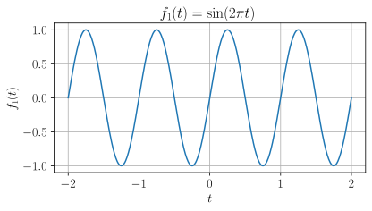
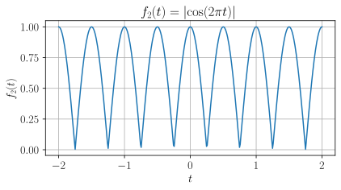
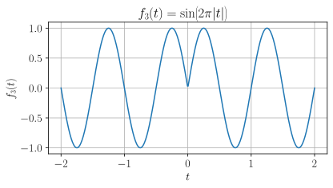
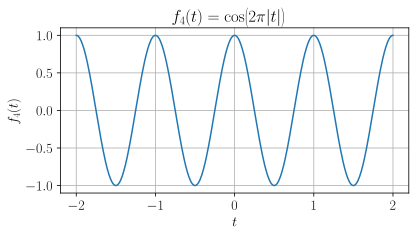
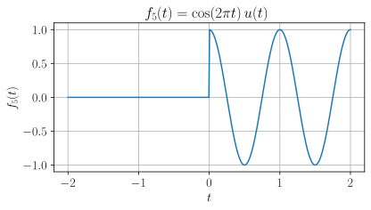

# Chapter 2 - Signal Properties
## Periodicity - Quiz

### Question 1

Which of the following signals is **periodic**?

Select all that apply.

  <ul>
    <li data-option="a" class="mathjax_process">A. $\quad f_{1}(t) = \sin(2\pi t)$</li>
    <li data-option="b" class="mathjax_process">B. $\quad f_{2}(t) = \lvert\cos(2\pi t)\rvert$</li>
    <li data-option="c" class="mathjax_process">C. $\quad f_{3}(t) = \sin(2\pi \lvert t \rvert)$</li>
    <li data-option="d" class="mathjax_process">D. $\quad f_{4}(t) = \cos(2\pi \lvert t \rvert)$</li>
    <li data-option="e" class="mathjax_process">E. $\quad f_{5}(t) = \cos(2\pi t)u(t)$</li>
    <li data-option="f" class="mathjax_process">F. $\quad$ None of the above.</li>
  </ul>
  <button class="mcq-check">Check answer</button>
  

??? success "Show answer"
    Signal A is **periodic** with fundamental period $T=1$:
    
    ??? info "Show plot"
        
    
    ??? example "Show derivation"

        $$
        f_{1}(t) = \sin{(2\pi t)}
        $$

        $$
        \begin{align*}
        f_{1}(t + 1) &= \sin{(2\pi(t + 1))} \\
                     &= \sin{(2\pi t + 2\pi)} \\
                     &= \sin{(2\pi t)} \\
                     &= f_{1}(t)
        \end{align*}
        $$

    ---

    Signal B is **periodic** with fundamental period $T = \tfrac{1}{2}$:

    ??? info "Show plot"
        

    ??? example "Show derivation"
    
        $$
        f_{2}(t) = |\cos{(2\pi t)}|
        $$

        $$
        \begin{align*}
        f_{2}\left(t + \tfrac{1}{2}\right) &= |\sin{(2\pi(t + \tfrac{1}{2}))} \\
                     &= |\cos{(2\pi t + \pi)}| \\
                     &= |-\cos{(2\pi t)}| \\
                     &= |\cos{(2\pi t)}| \\
                     &= f_{2}(t)
        \end{align*}
        $$

    ---

    Signal C is **non-periodic**:

    ??? info "Show plot"
        

    ??? example "Show derivation"
    
        $$
        f_{3}(t) = \sin{(2\pi |t|)}
        $$

       

        We can rewrite this as a piecewise function

        $$
        f_{3}(t) = \begin{cases}\sin{(2\pi t)},\quad &t \geq 0 \\ \sin{(-2\pi t)},\quad &t < 0\end{cases}
        $$
        
        And due to the properties of the sine function, this becomes
        
        $$
        f_{3}(t) = \begin{cases}\sin{(2\pi t)},\quad &t \geq 0 \\ -\sin{(2\pi t)},\quad &t < 0\end{cases}
        $$

        Now, if there were no absolute value sign, the signal would have a fundamental period of $T=1$, which means that the function would also be periodic with period $T=k,\quad k\in\mathbb{Z}$.

        Let's consider these cases, as the signal definitely won't line up for any other values of $T$.

        $$
        f_{3}(t - k) = \begin{cases}\sin{(2\pi t)},\quad &t - k \geq 0 \\ -\sin{(2\pi t)},\quad &t - k < 0\end{cases}
        $$

        We can rewrite this as:

        $$
        f_{3}(t - k) = \begin{cases}\sin{(2\pi t)},\quad &t \geq k \\ -\sin{(2\pi t)},\quad &t < k\end{cases}
        $$

        Now the following must hold for all $t$, for the signal to be periodic.

        $$
        f_{3}(t) = f_{3}(t - k),\quad \forall \, t\in \mathbb{R}
        $$

        But no matter what $k$ value we have, we can always find a $t$ value for which the statement fails to hold.

        **Case 1:** $k\geq 1$:
        
        For this case we can simply test $t=\tfrac{1}{4}$.

        Since $t=\tfrac{1}{4}>0$ we keep the sign:

        $$
        f_{3}\left(\tfrac{1}{4}\right) = \sin{\left(2\pi \cdot \tfrac{1}{4}\right)} = \sin{\left(\tfrac{\pi}{2}\right)} = 1
        $$

        Since $t=\tfrac{1}{4}<k$ we flip the sign:

        $$
        f_{3}\left(\tfrac{1}{4} - k\right) = -\sin{\left(2\pi \cdot \tfrac{1}{4} - 2\pi k\right)} = -\sin{\left(\tfrac{\pi}{2}\right)} = -1
        $$

        $$
        f_{3}\left(\tfrac{1}{4}\right) \neq f_{3}\left(\tfrac{1}{4} - k\right)
        $$

        **Case 2:** $k\leq -1$:
        
        For the other case we can test $t=-\tfrac{1}{4}$.

        Since $t=-\tfrac{1}{4}<0$ we flip the sign:

        $$
        f_{3}\left(-\tfrac{1}{4}\right) = \sin{\left(2\pi \cdot \left(-\tfrac{1}{4}\right)\right)} = \sin{\left(-\tfrac{\pi}{2}\right)} = -\sin{\left(\tfrac{\pi}{2}\right)} = -1
        $$

        Since $t=-\tfrac{1}{4}>k$ we keep the sign:

        $$
        f_{3}\left(\tfrac{1}{4} - k\right) = -\sin{\left(2\pi \cdot \left(-\tfrac{1}{4}\right) - 2\pi k\right)} = \sin{\left(\tfrac{\pi}{2}\right)} = 1
        $$

        $$
        f_{3}\left(-\tfrac{1}{4}\right) \neq f_{3}\left(-\tfrac{1}{4} - k\right)
        $$

    ---

    Signal D is **periodic** with fundamental period $T=1$:

    ??? info "Show plot"
        

    ??? example "Show derivation"

        $$
        f_{4}(t) = \cos{(2\pi |t|)}
        $$
        
        Unlike Signal C, the absolute value actually doesn't change the signal.

        Writing this piecewise, we get:

        $$
        f_{4}(t) = \begin{cases}\cos{(2\pi t)},\quad &t \geq 0 \\ \cos{(-2\pi t)},\quad &t < 0\end{cases}
        $$

        But due to the properties of cosine, this becomes:

        $$
        f_{4}(t) = \begin{cases}\cos{(2\pi t)},\quad &t \geq 0 \\ \cos{(2\pi t)},\quad &t < 0\end{cases}
        $$

        So we simply have:
        
        $$
        f_{4}(t) = \cos{(2\pi t)}
        $$

    ---

    Signal E is **non-periodic**:

    ??? info "Show plot"
        
    
    ??? example "Show derivation"

        $$
        f_{5}(t) = \cos{(2\pi t)}u(t)
        $$

        We can write this as a piecewise function:

        $$
        f_{5}(t) =
        \begin{cases}
        \cos{(2\pi t)},\quad &t\geq 0 \\
        0,\quad &t<0 \\
        \end{cases}
        $$

        Now, if there were no unit step function, the signal would have a fundamental period of $T=1$, which means that the function would also be periodic with period $T=k,\quad k\in\mathbb{Z}$.

        Let's consider these cases, as the signal definitely won't line up for any other values of $T$.

        $$
        f_{5}(t - k) = \begin{cases}\cos{(2\pi t)},\quad &t - k \geq 0 \\ 0,\quad &t - k < 0\end{cases}
        $$

        We can rewrite this as:

        $$
        f_{5}(t - k) = \begin{cases}\cos{(2\pi t)},\quad &t \geq k \\ 0,\quad &t < k\end{cases}
        $$

        Now the following must hold for all $t$, for the signal to be periodic.

        $$
        f_{5}(t) = f_{5}(t - k),\quad \forall \, t\in \mathbb{R}
        $$

        But no matter what $k$ value we have, we can always find a $t$ value for which the statement fails to hold.

        **Case 1:** $k\geq 1$:
        
        For this case we can simply test $t=\tfrac{1}{2}$.

        Since $t=\tfrac{1}{2}>0$ the function is non-zero:

        $$
        f_{5}\left(\tfrac{1}{2}\right) = \cos{\left(2\pi \cdot \tfrac{1}{2}\right)} = \cos{\left(\pi\right)} = -1
        $$

        Since $t=\tfrac{1}{2}<k$ the function goes to zero:

        $$
        f_{5}\left(\tfrac{1}{2} - k\right) = 0
        $$

        $$
        f_{5}\left(\tfrac{1}{2}\right) \neq f_{5}\left(\tfrac{1}{2} - k\right)
        $$

        **Case 2:** $k\leq -1$:
        
        For the other case we can test $t=-\tfrac{1}{2}$.

        Since $t=-\tfrac{1}{2}<0$ the function goes to zero:

        $$
        f_{5}\left(-\tfrac{1}{2}\right) = 0
        $$

        Since $t=-\tfrac{1}{2}>k$ the function is non-zero:

        $$
        f_{5}\left(\tfrac{1}{2} - k\right) = \cos{\left(2\pi \cdot \left(-\tfrac{1}{2}\right) - 2\pi k\right)} = \cos{\left(\pi\right)} = -1
        $$

        $$
        f_{5}\left(-\tfrac{1}{2}\right) \neq f_{5}\left(-\tfrac{1}{2} - k\right)
        $$

### Question 2

Which of the following signals is **non-periodic**?

Select all that apply.

  <ul>
    <li data-option="a" class="mathjax_process">A. $\quad g_{1}(t) = \sin{(2\pi t)} + \sin{(4\pi t)}$</li>
    <li data-option="b" class="mathjax_process">B. $\quad g_{2}(t) = \sin{(t)} + \sin{(\sqrt{2}t)}$</li>
    <li data-option="c" class="mathjax_process">C. $\quad g_{3}(t) = \sin{\left(2t\right)} + \cos{(3.14t)} + \sin{\left(1.\overline{81}t\right)}$ (repeating)</li>
    <li data-option="d" class="mathjax_process">D. $\quad g_{4}(t) = \cos{(2\pi t)} + 2\cos{(12\pi t)}\sin{(25\pi t)}$</li>
    <li data-option="e" class="mathjax_process">E. $\quad g_{5}(t) = \sin{(2\pi t)} + \sin{(t)}$</li>
    <li data-option="f" class="mathjax_process">F. $\quad$ None of the above.</li>
  </ul>
  <button class="mcq-check">Check answer</button>
  

### Question 3

Which of the following *discrete-time signals* is **periodic**?

Select all that apply.

  <ul>
    <li data-option="a" class="mathjax_process">A. $\quad h_{1}[n] = (-1)^{n}$</li>
    <li data-option="b" class="mathjax_process">B. $\quad h_{2}[n] = \sin{\left(\frac{\pi n}{2}\right)}$</li>
    <li data-option="c" class="mathjax_process">C. $\quad h_{3}[n] = \cos{\left(\frac{2\pi n}{10}\right)} + \cos{\left(\frac{4\pi n}{10}\right)}$</li>
    <li data-option="d" class="mathjax_process">D. $\quad h_{4}[n] = \cos{(n)} + \cos{(2n)}$</li>
    <li data-option="e" class="mathjax_process">E. $\quad h_{5}[n] = n\ \mathrm{mod}\ 4$ (i.e., $\{0,1,2,3,0,1,\dots\}$)</li>
    <li data-option="f" class="mathjax_process">F. $\quad$ None of the above.</li>
  </ul>
  <button class="mcq-check">Check answer</button>
  

