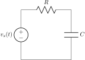
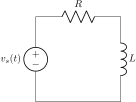

# Module 1: Theory

Here we'll put the detailed notes and derivations.

Example equation:

$$
y(t) = \int_{-\infty}^{\infty} x(\tau) h(t - \tau) \, d\tau
$$

## Example: RC low-pass filter

Here is the circuit we'll analyse:

<figure class="circuit-figure">
  
  <figcaption>Figure 1: Series RC low-pass filter used in this module.</figcaption>
</figure>

<figure class="circuit-figure">
  
  <figcaption>Figure 2: Series RL high-pass filter used in this module.</figcaption>
</figure>

We will derive the transfer function

$$
H(s) = \frac{V_o(s)}{V_s(s)} = \frac{1}{1 + sRC}.
$$
